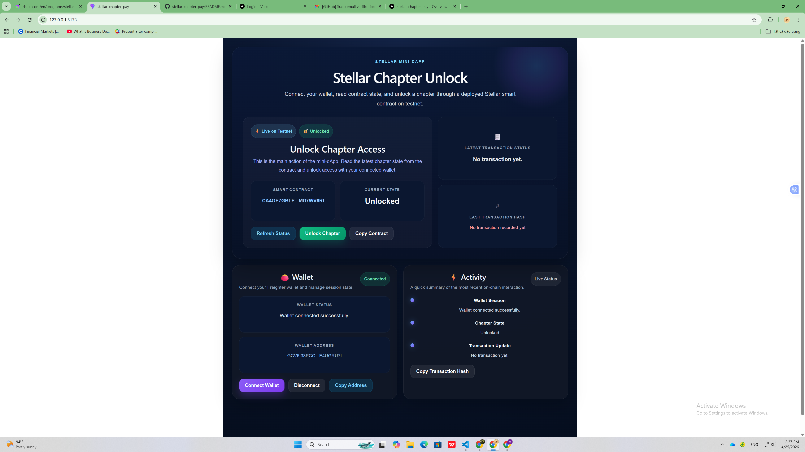
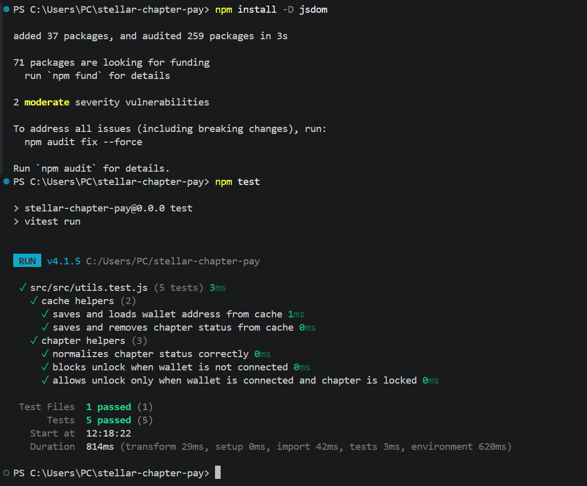

# Level 3 – Stellar Chapter Unlock Mini-dApp

## Goal

Turn the previous project into a more complete end-to-end mini-dApp with better quality, testing, documentation, and deployment.

## Level 3 Features

- Improved frontend layout with a more polished mini-dApp interface
- Loading states for wallet connection, status refresh, and unlock flow
- Basic caching with `localStorage`
- Reusable utility helpers
- Automated tests with Vitest
- Live deployed frontend
- Improved structure for submission and demo

## Live Demo

[Open the live app](https://stellar-chapter-pay.vercel.app/)

## Level 3 Improvements

- Cache wallet address
- Cache chapter status
- Cache latest transaction hash
- Show loading state when connecting wallet
- Show loading state when refreshing chapter status
- Show loading state when unlocking chapter
- Keep error handling from Level 2
- Add automated tests for cache and chapter helpers
- Polish the UI for a cleaner and more modern final demo

## Level 3 Final UI

## Test Coverage

The project currently includes **5 passing tests**.

### Test Screenshot

## Demo Video

Add your 1-minute demo video link here after recording:

`PASTE_YOUR_DEMO_VIDEO_LINK_HERE`