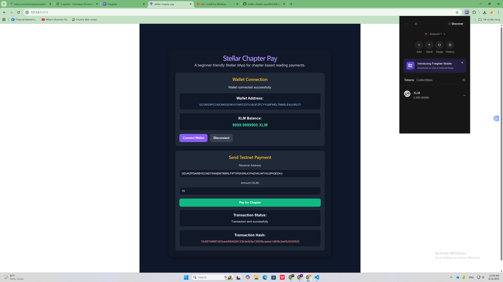
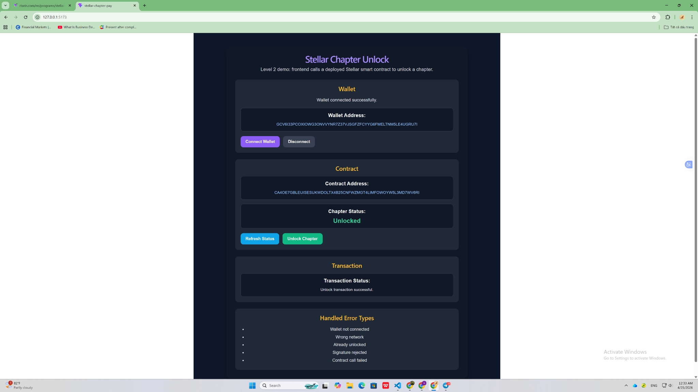
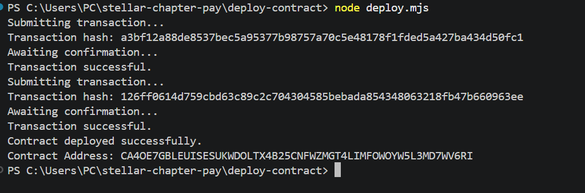
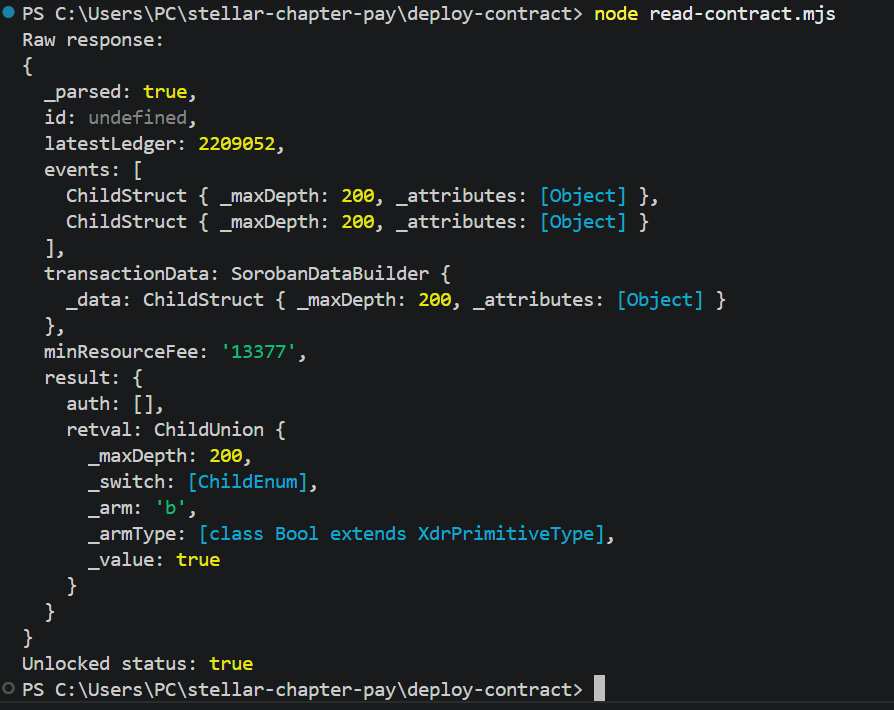
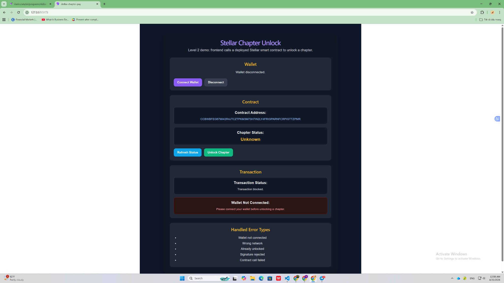
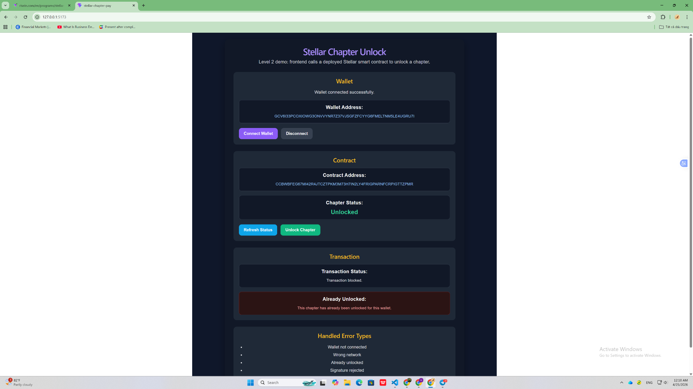
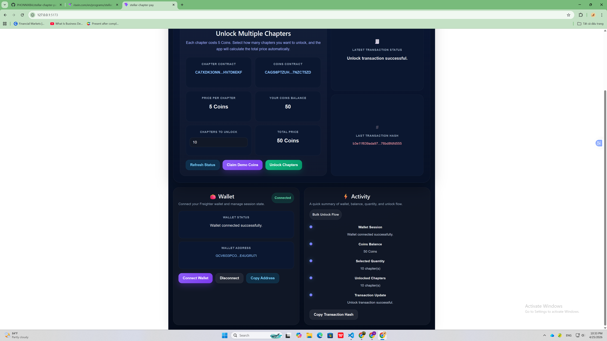
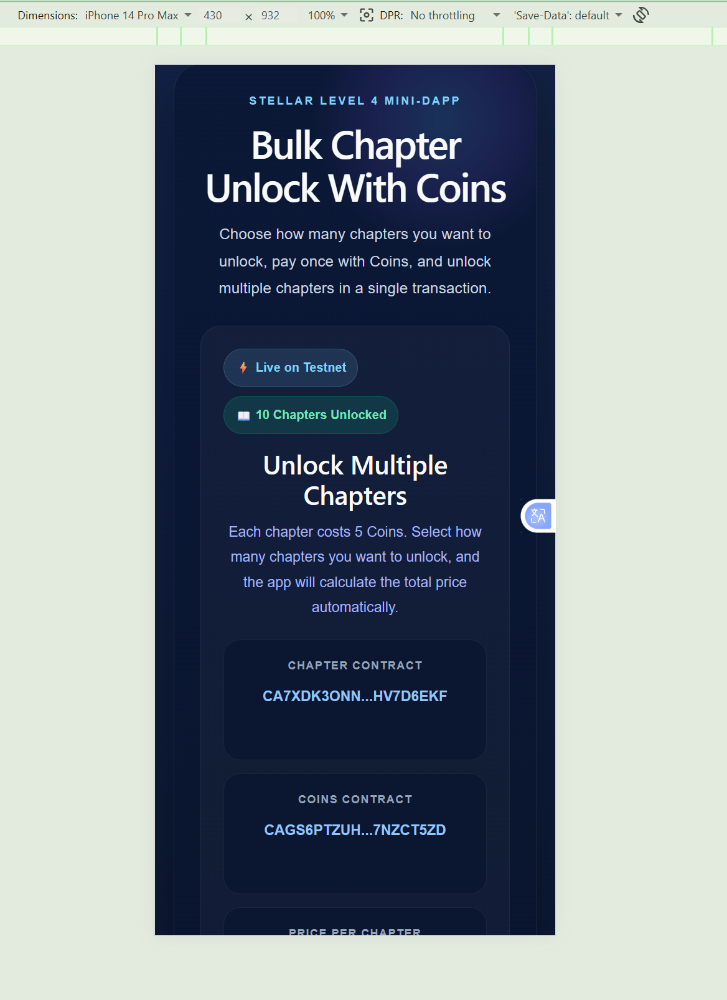
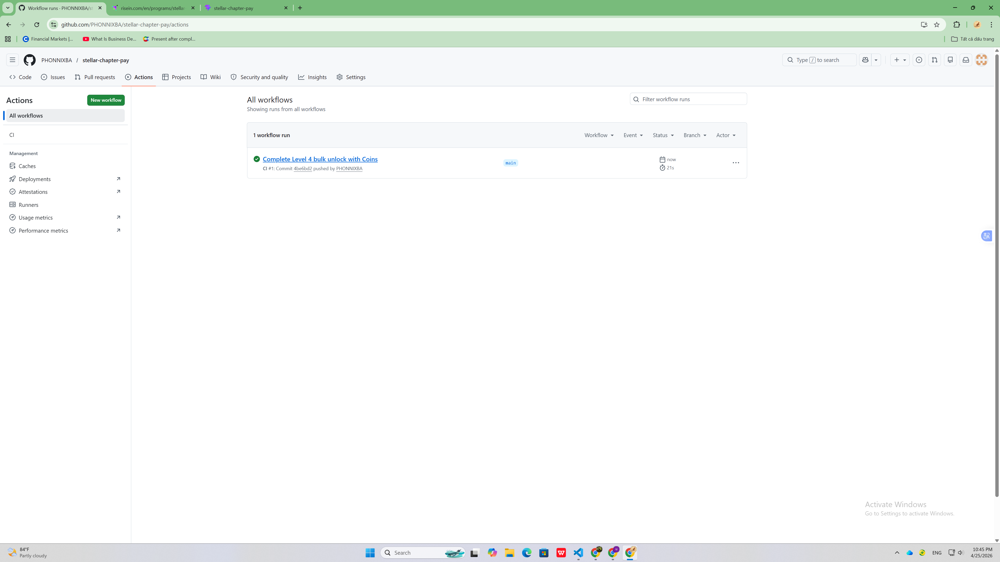

# Stellar Chapter Journey

This repository documents my progress through **Level 1**, **Level 2**, **Level 3**, and **Level 4** of the Stellar learning path.

The project started as a simple payment demo on Stellar Testnet, then evolved into a smart contract based chapter unlock mini-dApp, and finally into a more product-oriented bulk unlock experience using Coins and inter-contract calls.

---

## Project Overview

This project is based on a bigger product idea:

> a reading platform on Stellar where users unlock chapters and, in future versions, authors can receive transparent revenue sharing through smart contracts.

To match the learning path requirements, the project was developed in stages:

- **Level 1:** wallet connection, balance display, and testnet payment flow
- **Level 2:** smart contract deployment, contract interaction from the frontend, chapter unlock logic, and error handling
- **Level 3:** a more complete mini-dApp with loading states, basic caching, tests, documentation, live deployment, and a polished final UI
- **Level 4:** bulk chapter unlock with Coins, inter-contract call logic, responsive design, CI/CD, and a more realistic product payment flow

---

# Level 1 – Stellar Chapter Pay

## Goal

Build a beginner-friendly Stellar dApp on **Stellar Testnet** that demonstrates the basic payment flow.

## Level 1 Features

- Connect Freighter wallet
- Disconnect wallet
- Display connected wallet address
- Fetch and display XLM balance
- Send XLM payment on Testnet
- Show transaction success or failure
- Show transaction hash after payment

## Level 1 Tech Stack

- React
- Vite
- Freighter API
- Stellar SDK

## Level 1 Screenshot



---

# Level 2 – Stellar Chapter Unlock

## Goal

Extend the project into a smart contract powered dApp where users can unlock a chapter through a deployed contract on Stellar Testnet.

## Level 2 Features

- Connect wallet from the frontend
- Read chapter unlock state from the contract
- Call the `unlock` contract function from the frontend
- Show transaction status
- Show transaction hash
- Handle user and wallet errors clearly in the UI

## Smart Contract

### Current Contract Address
`CA4OE7GBLEUISESUKWDOLTX4B25CNFWZMGT4LIMFOWOYW5L3MD7WV6RI`

### Main Functions

- `is_unlocked(user)` → checks whether a chapter is unlocked
- `unlock(user)` → unlocks the chapter for the connected wallet

## Level 2 Deployment Evidence

### WASM Upload Transaction Hash
`a3bf12a88de8537bec5a95377b98757a70c5e48178f1fded5a427ba434d50fc1`

### Contract Deploy Transaction Hash
`126ff0614d759cbd63c89c2c704304585bebada854348063218fb47b660963ee`

## Level 2 Error Handling

The frontend handles these error cases:

- Wallet not connected
- Wrong network
- Already unlocked
- Signature rejected
- Contract call failed

## Level 2 Screenshots

### Frontend Success


### Contract Deploy Success


### Read Contract Status


### Error - Wallet Not Connected


### Error - Wrong Network


### Error - Already Unlocked


---

# Level 3 – Stellar Chapter Unlock Mini-dApp

## Goal

Turn the previous project into a more complete end-to-end mini-dApp with better quality, testing, documentation, deployment, and final UI polish.

## Level 3 Features

- Improved frontend layout with a more polished mini-dApp interface
- Loading states for wallet connection, status refresh, and unlock flow
- Basic caching with `localStorage`
- Reusable utility helpers
- Automated tests with Vitest
- Live deployed frontend
- Improved structure for submission and demo

## Live Demo

[Open the live app](https://stellar-chapter-pay.vercel.app/)

## Level 3 Improvements

- Cache wallet address
- Cache chapter status
- Cache latest transaction hash
- Show loading state when connecting wallet
- Show loading state when refreshing chapter status
- Show loading state when unlocking chapter
- Keep error handling from Level 2
- Add automated tests for cache and chapter helpers
- Polish the UI for a cleaner and more modern final demo

## Level 3 Final UI


## Test Coverage

The project currently includes **5 passing tests**.

### Test Screenshot


## Demo Video

Add your 1-minute demo video link here after recording:

`PASTE_YOUR_DEMO_VIDEO_LINK_HERE`

---

# Level 4 – Bulk Chapter Unlock With Coins

## Goal

Upgrade the project from a single chapter unlock demo into a more realistic mini-dApp where users can unlock **multiple chapters in one transaction** using Coins on Stellar Testnet.

## Level 4 Features

- Bulk chapter unlock flow
- Coins-based payment model
- Inter-contract call between chapter contract and Coins contract
- Demo Coins claim flow
- Auto-calculated total price based on chapter quantity
- Auto-loaded contract addresses from `public/contracts.json`
- Mobile responsive UI
- GitHub Actions CI/CD
- Live deployed frontend

## Product Flow

1. User connects wallet
2. App reads:
   - price per chapter
   - current Coins balance
   - unlocked chapter count
3. User claims demo Coins
4. User chooses how many chapters to unlock
5. App calculates the total price automatically
6. User confirms payment
7. Chapters are unlocked in bulk after a successful transaction

## Pricing Model

- **1 chapter = 5 Coins**
- Users can claim demo Coins for testing
- Total price is calculated as:

`total price = chapter quantity × 5 Coins`

Examples:
- 1 chapter = 5 Coins
- 3 chapters = 15 Coins
- 10 chapters = 50 Coins

## Level 4 Contracts

### Coins Contract
`CAGS6PTZUHT7NKIMMYDJPAAHKSWBMEMY22TQX2563JVNHLHJK7NZCT5ZD`

### Chapter Contract
`CA7XDK3ONNIWEUUWUCOBU2Z4K27CLFOEVMDW774YLELDVGY5HV7D6EKF`

## Level 4 Deployment Evidence

### Token Init Hash
`e6b97b38a7dbee513feada6cc023ab163f1e1d5e835821cf6179e57dad9c1ee7`

### Chapter Init Hash
`2c39b7fc63a5f7e49eba4b726da4a6099fe8f3372f75cdfe094859ac900eeb7e`

### Price Per Chapter
`5 Coins`

## Inter-Contract Call Logic

This version uses two contracts:

- **Coins contract** → manages demo Coins and user balances
- **Chapter contract** → manages chapter unlock logic and unlocked count

When a user clicks **Unlock Chapters**:

- the frontend calls the chapter contract
- the chapter contract calls the Coins contract
- the required Coins amount is transferred
- if payment succeeds, the unlocked chapter count is increased

This is the main contract interaction flow for Level 4.

## Level 4 Final UI



## Level 4 Mobile Responsive View



## Level 4 CI/CD



## Example Successful Flow

A tested successful scenario in this version:

- wallet connected successfully
- user claimed demo Coins
- chapter price remained 5 Coins
- user selected **10 chapters**
- app calculated total price = **50 Coins**
- transaction completed successfully
- unlocked chapter count increased to **10**
- remaining balance was updated correctly

## Notes

- Contract addresses are automatically loaded from `public/contracts.json`
- This version is deployed and tested on **Stellar Testnet**
- The UI is designed to present the product flow clearly on both desktop and mobile

## Demo Video

Add your Level 4 demo video link here after recording:

`PASTE_YOUR_LEVEL4_DEMO_VIDEO_LINK_HERE`

---

# How to Run Locally

## 1. Clone the repository

```bash
git clone https://github.com/PHONNIXBA/stellar-chapter-pay.git
cd stellar-chapter-pay